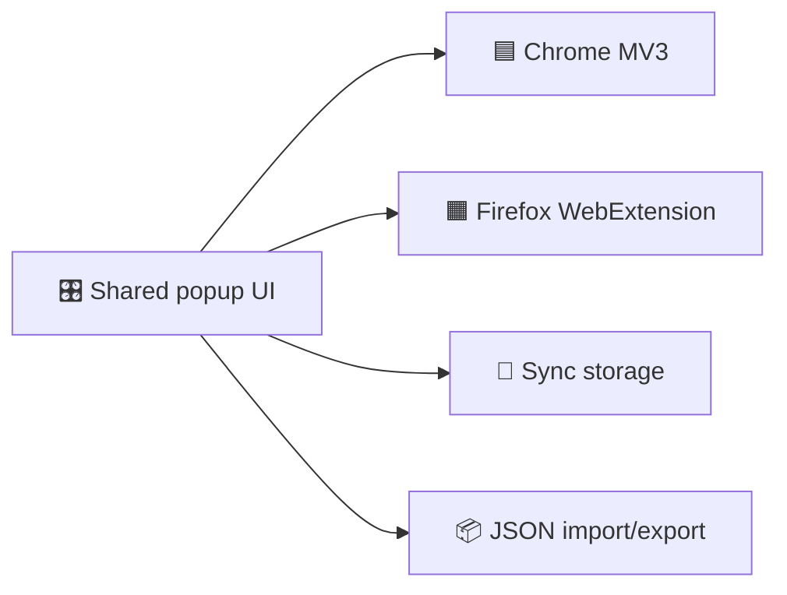

# My Switcher Browser Extension

<p align="center">
  🌐 <a href="#en-us">English</a> · <a href="#zh-cn">简体中文</a>
</p>

<p align="center">
  ⚡ Compact popup · 🧠 Google AI apps · 🌍 Chrome + Firefox · 📦 Backup import/export
</p>

> 🚀 One shared React/Vite popup codebase for Chrome MV3 and Firefox WebExtension builds.



<a id="en-us"></a>

## 🇺🇸 English

### ✨ Overview

My Switcher is a cross-browser extension for opening Google AI tools and common Google services with the right account slot. The popup is intentionally compact, so the main actions, built-in apps, and custom apps stay easy to scan without wasting vertical space.

### 🧩 Key Features

| Feature | Description |
| --- | --- |
| 🧭 Account-aware launch | Opens supported Google apps with the selected `authuser` account slot. |
| 🪄 Compact UI | Uses a dense popup grid and lightweight controls to reduce scrolling. |
| ➕ Custom apps | Lets users add and remove their own app shortcuts. |
| 📦 Backup import/export | Exports custom apps to JSON and validates imported files before saving. |
| 🌗 Theme toggle | Supports light and dark theme switching in the popup. |
| 🔁 Storage fallback | Uses extension sync storage first and falls back to local preview storage when needed. |

### 🌍 Browser Targets

| Browser | Manifest | Build Output | Package Output |
| --- | --- | --- | --- |
| 🟦 Chrome | `extension/manifest.json` | `dist/chrome/` | `artifacts/my-switcher-chrome.zip` |
| 🟧 Firefox | `extension/manifest.firefox.json` | `dist/firefox/` | `artifacts/my-switcher-firefox.xpi` |

Shared runtime behavior is handled by `src/lib/webextension.ts`, which normalizes `chrome.*` and `browser.*` access for popup storage and tab creation.

### 🗂️ Project Structure

- `popup.html`: popup entry consumed by Vite.
- `src/App.tsx`: popup UI and interaction logic.
- `src/index.css`: compact layout tokens, theming, and popup styling.
- `src/lib/custom-app-backup.ts`: backup export and validated import parsing.
- `src/lib/popup-state.ts`: sync storage and local fallback state handling.
- `scripts/build-extension.mjs`: target-aware build entry.
- `scripts/package-extension.mjs`: target-aware packager.

### 🚀 Local Preview

1. Install dependencies:
   `npm install`
2. Start the popup preview:
   `npm run dev`

The dev server uses local storage when it is not running inside an extension runtime.

### 🏗️ Build Commands

Default build:

```bash
npm run build
```

Explicit Chrome build:

```bash
npm run build:chrome
```

Explicit Firefox build:

```bash
npm run build:firefox
```

### 📦 Package Commands

Chrome package:

```bash
npm run package:chrome
```

Firefox package:

```bash
npm run package:firefox
```

If the default Firefox artifact is locked by the browser, the packager falls back to a timestamped filename in `artifacts/`.

### 🧪 Load Unpacked Builds

- 🟦 Chrome:
  Open `chrome://extensions`, enable Developer Mode, choose "Load unpacked", and select `dist/chrome/`.
- 🟧 Firefox:
  Open `about:debugging#/runtime/this-firefox`, choose "Load Temporary Add-on", and select `dist/firefox/manifest.json`.

### 🏪 Publishing Notes

- 🟦 Chrome Web Store:
  Keep permissions minimal. The current Chrome manifest only requests `storage`.
- 🟧 Firefox AMO:
  Update `browser_specific_settings.gecko.id` in `extension/manifest.firefox.json` before publishing.

### 🔧 Compatibility Notes

- `src/lib/popup-state.ts` prefers extension sync storage and falls back to `localStorage` in preview mode or runtime failure.
- Import accepts either the structured My Switcher backup payload or a raw custom app array, but rejects malformed entries and unsupported schema versions.

---

<a id="zh-cn"></a>

## 🇨🇳 简体中文

### ✨ 项目概述

My Switcher 是一个面向 Chrome 与 Firefox 的跨浏览器插件，用于按账号槽位快速打开 Google AI 工具和常用 Google 服务。弹窗界面采用紧凑布局，保证常用操作、内置应用和自定义应用都能更高效地浏览。

### 🧩 核心能力

| 功能 | 说明 |
| --- | --- |
| 🧭 按账号打开应用 | 为支持的 Google 应用自动带上当前选择的 `authuser` 账号参数。 |
| 🪄 紧凑型 UI | 使用高密度网格和轻量操作区，尽量减少滚动。 |
| ➕ 自定义应用 | 支持新增、删除自定义快捷入口。 |
| 📦 备份导入导出 | 可将自定义应用导出为 JSON，并在导入前执行格式校验。 |
| 🌗 主题切换 | 支持弹窗内的明暗主题切换。 |
| 🔁 存储降级 | 优先使用扩展同步存储，必要时回退到本地预览存储。 |

### 🌍 浏览器目标

| 浏览器 | Manifest | 构建目录 | 打包产物 |
| --- | --- | --- | --- |
| 🟦 Chrome | `extension/manifest.json` | `dist/chrome/` | `artifacts/my-switcher-chrome.zip` |
| 🟧 Firefox | `extension/manifest.firefox.json` | `dist/firefox/` | `artifacts/my-switcher-firefox.xpi` |

共享运行时适配层位于 `src/lib/webextension.ts`，用于统一 `chrome.*` 与 `browser.*` 在存储和标签页创建上的调用差异。

### 🗂️ 项目结构

- `popup.html`: Vite 弹窗入口。
- `src/App.tsx`: 弹窗界面与交互逻辑。
- `src/index.css`: 紧凑布局变量、主题和样式定义。
- `src/lib/custom-app-backup.ts`: 备份导出与导入校验逻辑。
- `src/lib/popup-state.ts`: 同步存储与本地降级状态处理。
- `scripts/build-extension.mjs`: 面向多目标的构建入口。
- `scripts/package-extension.mjs`: 面向多目标的打包脚本。

### 🚀 本地预览

1. 安装依赖：
   `npm install`
2. 启动弹窗预览：
   `npm run dev`

当运行环境不是浏览器扩展时，开发预览会自动使用本地存储。

### 🏗️ 构建命令

默认构建：

```bash
npm run build
```

显式构建 Chrome：

```bash
npm run build:chrome
```

显式构建 Firefox：

```bash
npm run build:firefox
```

### 📦 打包命令

打包 Chrome：

```bash
npm run package:chrome
```

打包 Firefox：

```bash
npm run package:firefox
```

如果默认的 Firefox 产物文件被浏览器占用，打包脚本会自动回退为带时间戳的文件名并输出到 `artifacts/`。

### 🧪 加载未打包版本

- 🟦 Chrome：
  打开 `chrome://extensions`，启用开发者模式，点击 "Load unpacked"，选择 `dist/chrome/`。
- 🟧 Firefox：
  打开 `about:debugging#/runtime/this-firefox`，点击 "Load Temporary Add-on"，选择 `dist/firefox/manifest.json`。

### 🏪 发布说明

- 🟦 Chrome Web Store：
  建议保持最小权限集，当前 Chrome manifest 仅申请了 `storage`。
- 🟧 Firefox AMO：
  发布前请先更新 `extension/manifest.firefox.json` 中的 `browser_specific_settings.gecko.id`。

### 🔧 兼容性说明

- `src/lib/popup-state.ts` 会优先使用扩展同步存储，在预览环境或运行时失败时回退到 `localStorage`。
- 导入功能既支持 My Switcher 的结构化备份，也支持原始自定义应用数组，但会拒绝非法条目和不支持的 schema 版本。
